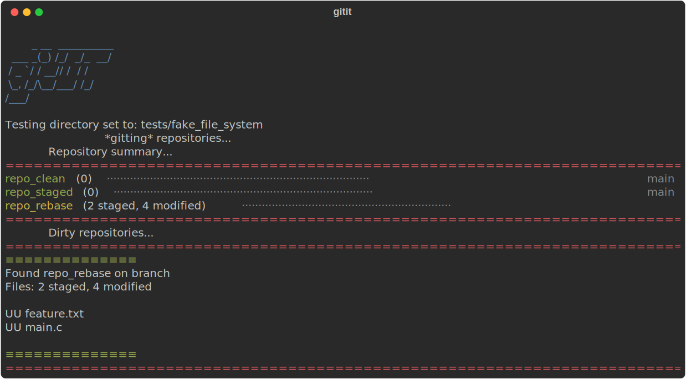
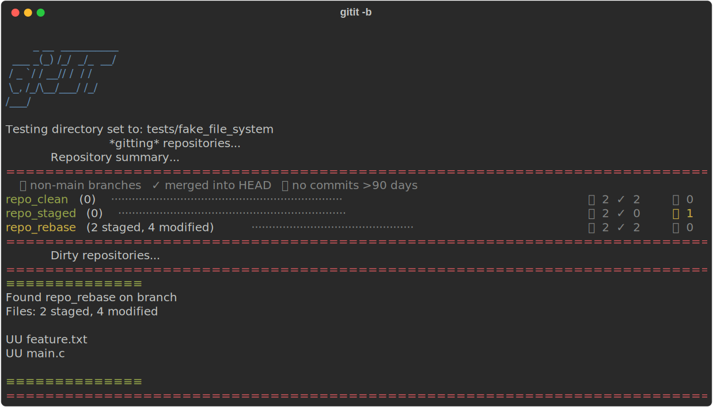
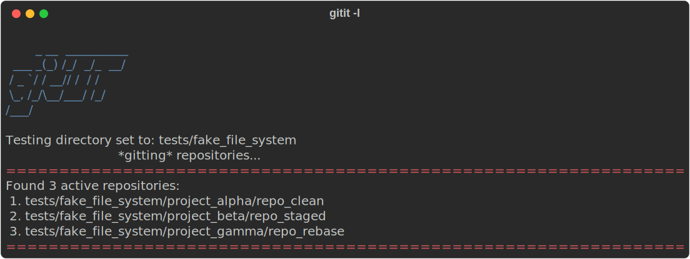
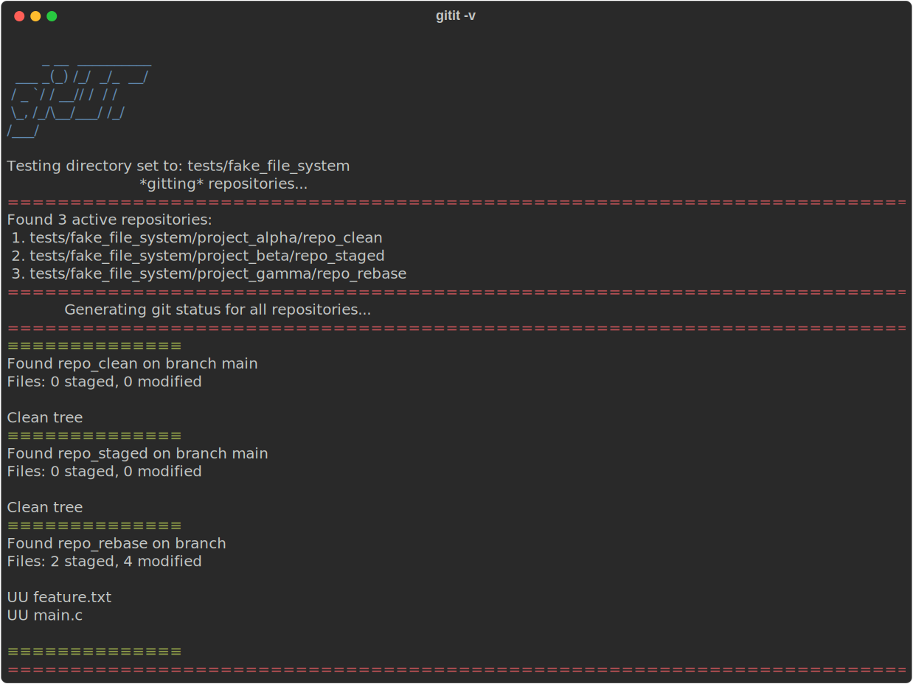

# gitIt
*ha, get it?*

**gitIt** searches a directory for git repositories and gives you a fast, colour-coded summary of their state. Default target is your current directory; use `-d` to point it anywhere.

## Installation

```bash
git clone https://github.com/sudo-haggis/gitIt ~/gitIt && cd ~/gitIt && chmod +x installer.sh && ./installer.sh
```

## Usage

```
gitit [flags]
```

| Flag | Alias | Description |
|------|-------|-------------|
| `--help` | `-h` | Show this help message |
| `--verbose` | `-v` | Full output for all repos, including clean ones |
| `--branches` | `-b` | Show branch count, merged and stale breakdown per repo |
| `--dir <path>` | `-d` | Run against a specific directory instead of `$HOME` |
| `--list` | `-l` | List found repositories without status detail |
| `--ignore-repo <REGEX>` | | Add a pattern to the ignore list |

Flags can be combined freely — for example:

```bash
gitit -d ~/projects -b -v
```

---

## Default view

A compact, colour-coded summary of every repo that has uncommitted work. Clean repos are shown but dimmed; dirty repos get a detailed breakdown below the summary.



---

## Branch view  `-b` / `--branches`

Each repo shows a branch health summary instead of the current branch name:

```
 <total non-main branches>   ✓ <merged into HEAD>    <stale — no commits in 90 days>
```

Stale counts are highlighted in yellow when non-zero so branch debt is impossible to miss.



---

## List view  `-l` / `--list`

Prints a numbered list of every repo found, with a total count. Useful for a quick inventory or for scripting.



---

## Verbose view  `-v` / `--verbose`

Runs a full `git status` on every repo — not just dirty ones. Useful for a complete picture when you haven't touched a project in a while.



---

## Ignoring repos

Use a REGEX pattern to exclude repos from all reports:

```bash
gitit --ignore-repo <REGEX>
```

Patterns are stored at `~/.config/gitit/ignore.conf`. You can also edit that file directly — add the full path of any repo you want excluded.

---

## Generating the demo SVGs

The screenshots above are SVGs generated from live gitIt output via `rich`. To regenerate them after changing the tool's output:

```bash
pip install rich        # one-time
bash docs/record_demos.sh
```

SVGs are written to `docs/img/` and should be committed alongside any output-changing code changes.
